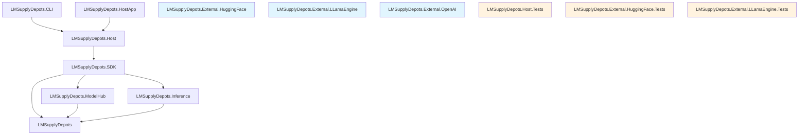

# LMSupplyDepots

[](https://github.com/iyulab/LMSupplyDepot/actions/workflows/hostapp.yml)
[](https://github.com/iyulab/LMSupplyDepot/blob/main/LICENSE)
[](https://github.com/iyulab/LMSupplyDepot/releases)

[](https://github.com/iyulab/LMSupplyDepot)

LMSupplyDepots는 로컬 환경에서 다양한 오픈소스 LLM을 쉽게 관리하고 실행할 수 있는 플랫폼입니다. 모듈식 아키텍처로 독립적인 컴포넌트 구성을 지원하며, 웹 API와 CLI 인터페이스를 통해 프라이버시를 유지하면서 강력한 AI 기능을 로컬에서 활용할 수 있습니다.

## ✨ Features

### 🔧 **로컬 모델 관리**
- 다양한 LLM 모델 다운로드 및 관리
- 모델 버전 관리 및 업데이트 기능
- 커스텀 모델 생성 및 수정 지원

### ⚡ **모델 인퍼런스 엔진**
- 로컬 GPU/CPU를 활용한 고성능 추론
- 다양한 모델 포맷(GGUF, GGML, SafeTensors) 지원
- 배치 처리 및 메모리 최적화

### 🌐 **호스팅 서비스**
- 로컬 서버 호스팅
- RESTful API 제공
- 웹 인터페이스를 통한 모델 관리

### 🎯 **모델 허브**
- 중앙화된 모델 레지스트리
- 다양한 소스에서 모델 가져오기
- 모델 메타데이터 관리

### 💻 **CLI 인터페이스**
- 명령줄을 통한 모델 관리
- 스크립팅 지원
- 배치 작업 처리

### 🔄 **확장성 및 모듈화**
- 플러그인 아키텍처
- 새로운 모델 백엔드 쉽게 추가 가능
- 독립적인 모듈 구성으로 유연한 확장

### 🖼️ **멀티모달 지원**
- 텍스트, 이미지 처리 가능한 모델 지원
- 멀티모달 입출력 처리

### 🛠️ **개발자 도구**
- API 클라이언트 SDK
- 샘플 코드 및 템플릿
- 통합 테스트 지원

### 🔒 **보안 및 접근 제어**
- API 키 관리
- 사용자 인증 및 권한 부여
- 모델 사용량 제한 및 모니터링

### 🚀 **크로스 플랫폼 지원**
- Windows, Linux, macOS 지원
- 도커 컨테이너 지원
- 하드웨어 가속화 최적화

## 🏗️ LMSupplyDepots 프로젝트 구조

### 핵심 라이브러리

**1. LMSupplyDepots**
- 도메인 모델, 인터페이스, 공통 유틸리티
- 다른 프로젝트에서 공유하는 기본 추상화
- 최소한의 외부 의존성 유지

**2. LMSupplyDepots.SDK**
- 사용자 진입점 (`var depot = new LMSupplyDepot(options)`)
- 내부적으로 격리된 ServiceCollection 관리
- 모든 기능을 통합해 단일 인터페이스 제공
- 유연한 설정과 확장성 제공

### 기능별 라이브러리

**3. LMSupplyDepots.ModelHub**
- 모델 검색, 다운로드, 관리 기능
- 모델 메타데이터 및 생명주기 관리
- 저장소 백엔드 추상화 (로컬 저장소, 원격 저장소)

**4. LMSupplyDepots.Inference**
- 모든 추론 관련 기능 통합
- TextGeneration 네임스페이스 - 텍스트 생성 기능
- Embeddings 네임스페이스 - 임베딩 생성 기능 
- 다양한 모델 형식 지원을 위한 추상화

### 독립적 외부 래퍼 라이브러리

**5. LMSupplyDepots.External.HuggingFace**
- Hugging Face Hub 클라이언트 구현
- 모델 검색, 다운로드 기능
- LMSupplyDepots 의존성 없음 (독립적 사용 가능)

**6. LMSupplyDepots.External.LLamaEngine**
- LLama, GGUF, GGML 모델 추론 엔진
- 텍스트 생성, 임베딩 생성 기능
- LMSupplyDepots 의존성 없음 (독립적 사용 가능)

**7. LMSupplyDepots.External.OpenAI**
- OpenAI 호환 클라이언트 및 서버
- 표준 OpenAI API 인터페이스 구현
- LMSupplyDepots 의존성 없음 (독립적 사용 가능)

### 호스팅 및 응용 프로그램

**8. LMSupplyDepots.Host**
- RESTful API 서버 구현 (OpenAI 호환)
- 다양한 엔드포인트 (모델 관리, 추론, 임베딩)
- SDK를 통한 핵심 기능 노출
- 표준 OpenAI API v1 스펙 완전 구현

**9. LMSupplyDepots.HostApp**
- 웹 서버 호스트 애플리케이션
- 설정 로드, 로깅, 서버 생명주기 관리
- 스탠드얼론 배포 지원

**10. LMSupplyDepots.CLI**
- 명령줄 인터페이스
- 모델 관리, 추론, 시스템 설정 명령
- SDK를 활용한 모든 기능 노출

## 📊 의존성 계층 구조



**애플리케이션 계층**
```
LMSupplyDepots.CLI ---> LMSupplyDepots.Host
LMSupplyDepots.HostApp ---> LMSupplyDepots.Host
```

**서버 계층**
```
LMSupplyDepots.Host ---> LMSupplyDepots.SDK
```

**테스트 계층**
```
LMSupplyDepots.Host.Tests
LMSupplyDepots.External.HuggingFace.Tests
LMSupplyDepots.External.LLamaEngine.Tests
```

**SDK 통합 계층**
```
LMSupplyDepots.SDK  ---> LMSupplyDepots
                    ---> LMSupplyDepots.ModelHub
                    ---> LMSupplyDepots.Inference
```

**기능 계층**
```
LMSupplyDepots.ModelHub ---> LMSupplyDepots
LMSupplyDepots.Inference ---> LMSupplyDepots
```

**독립적 외부 래퍼** *(아무런 종속성을 갖지 않습니다)*
```
LMSupplyDepots.External.HuggingFace (독립적)
LMSupplyDepots.External.LLamaEngine (독립적)
LMSupplyDepots.External.OpenAI (독립적)
```

**핵심 계층**
```
LMSupplyDepots (기본 공통 라이브러리)
```
